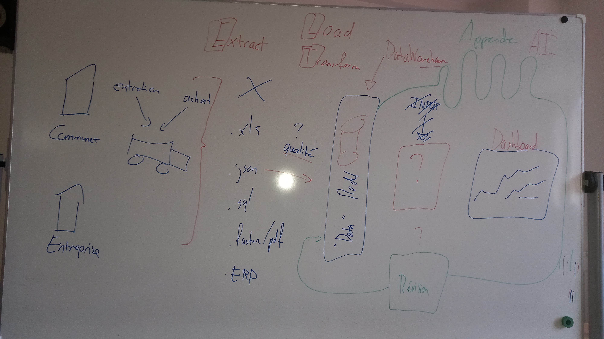

# Contexte

Voici le dessin réalisé lors du Kickoff du module pour vous initier à la BI.

<figure><figcaption>
Source : <a href="https://www.transvoirie.ch/articles/101/le-1er-camion-de-collecte-des-dechets-100-electrique">https://www.transvoirie.ch/articles/101/le-1er-camion-de-collecte-des-dechets-100-electrique</a>
</figcaption></figure>

<figure><figcaption>
Contexte de présentation de la BI
</figcaption></figure>

A retenir:

* La BI dépasse de loin la simple notion de "Business". Elle s'applique aujourd'hui à de nombreux domaines, que ce soit dans la prévention des accidents, la détection de maladie, l'optimisation de flux et aussi, à des processus commerciaux.
* Dans votre futur carrière de technicien, vous allez très certainement être impliqué dans ce type de problèmatique. Il est important, à la sortie de ce module, que vous ayez une compréhension du processus ELT (ou ETL) et des contraintes techniques avec lesquelles vous allez devoir vous "débattre".
* Le DataWarehouse est un point clé de la BI. La question d'avoir un ELT ou un ETL questionne directement la qualité des données que l'on accepte d'intégrer à notre "data model". Un système permissif nous demandera un effort conséquent pour rendre la donnée propre une fois présente dans le "DataWarehouse" alorsq qu'une approche restrictive prendra le risque de rejeter de la donnée ayant une valeur potentielle et ainsi appauvrir votre "DataWarehouse".
* Le DashBoard quant-à-lui a la lourde tâche de présenter de manière digeste les données présentes dans le DataWarehouse.
* L'intelligence articifielle est très présente dans la BI moderne. Le volume de données tout comme le nombre de variables à analyser ne permet plus aux outils classiques de BI de réaliser des analyses suffisantes, ou alors dans des délais bien trop long.
