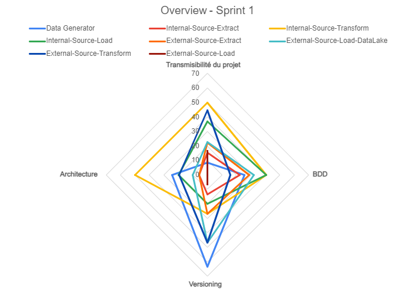

# Review

## Introduction

Ce document est émi à la fin du sprint 1 afin d'aider les différents _dev teams_ à identifier leur forces et les points d'améliorations avant l'ouverture du prochain sprint.

Actuellement 4 axes ont été observés:

| Axe                        | Détails                                                                                                                                           |
| -------------------------- | ------------------------------------------------------------------------------------------------------------------------------------------------- |
| Transmissibilité du projet | Readme, Wiki, Diagrammes                                                                                                                          |
| BDD - CI                   | Ecriture des classes de tests en suivant les principes du BDD. Pertinence des tests, couverture et utilisation d'un framework BDD.                |
| Versioning                 | Découpage en branche "feature", systématique des préfixes de commit + le contenu des commits.                                                     |
| Architecture               | Structure du projet, du code. Mise en évidence des différentes couches du futur microservice. Respect des principes REST, gestion des exceptions. |

## Vue d'ensemble

J'ai opté pour une représentation intégrant toutes les équipes. Cela vous permet d'avoir la vue d'ensemble et ainsi vous rapprocher des équipes qui semblent avoir "pris de l'avance" sur certains axes et vous en inspirer.

<figure><figcaption>
Radar représentation la fin du sprint 1
</figcaption></figure>

## Review globale

### Les 5 forces observées (à maintenir pour la suite du projet):

* _Pull requests_ entre développeurs. Excellent ! A faire dans toutes les équipes. N'hésitez pas à le faire entre projet.
* Toutes les équipes ont livré un projet qui traite plusieurs axes d'évaluations (et non pas que du code). C'est important de continuer de construire vos projets en pensant à tous les aspects, pas seulement le code ! Reprenez régulièrement les DoD pour valider vos livrables.
* Progression dans l'utilisation des branches et le découpage en "feature". Malgré un sprint court, l'amélioration est visible. Continuez ainsi !
* La réflexion sur votre architecture est en "marche" chez chacun. C'est un point essentiel.
  * Aidez-vous des "packages" pour bien isoler les différentes couches (layer). Votre API ne doit pas savoir ce que font les services.
  * Les services devraient pouvoir fonctionner sans avoir besoin d'une api (on reçoit un json... d'où il provient ne doit pas être impactant).
* Des tests, plus ou moins élaborés ;) sont présents dans les dépôts.
  * Utilisez dès que possible un framework de bdd. Vous avez déjà une bonne structure given/when/then. Avec un framework vous serez encore plus "guidé", notamment pour soigner la signature des méthodes et vous focaliser sur des vraies "feature".

### Les 5 points à améliorer dès le prochain sprint:

* Le Readme doit -vraiment- aider un collaborateur à venir travailler avec vous:
  * Ne mélangez pas les dépendances à installer pour l'IDE, qu'il faut mentionner et celles spécifiques au code qui sont présentes dans la config (pom.xml, requirements.txt)
  * Ce que vous annoncez en terme collaboratif (gestion des branches, commit) doit se voir ensuite dans vos pratiques.
  * Le document doit être aligné avec l'actuel état du dépôt.
  * N'oubliez pas de livrer un .env d'exemple.
  * Distinction entre dev et prod (build avec et sans les tests).
  * Distinction entre "build", "lancer les tests", "exécution".
* Le Diagramme de classes doit respecter les normes + le code que vous livrez.
  * Seuls les éléments publics doivent être présents.
  * Si un élément privé apparaît, c'est pour expliquer la relation entre deux classes (association par exemple).
* Le wiki mentionne les technologies que vous avez choisies ainsi que tous vos choix (stratégie de branches, type de framework pour l'api, stratégie de test).
* Utilisez dès que possible un fichier de config (genre .env) pour sortir toutes les constantes que l'on aimerait modifier pour le déploiement, sans devoir recompiler (nom du bucket, nom de la db, _credentials_)
* Séparez les données de la logique dans vos classes de tests. Un changement de données ne devrait pas impacter la classe de tests.

## Review spécifiques

Pour ce sprint, je renonce à une review spécifique par équipe. Nous avons déjà bien pu échanger et les points essentiels sont tous mentionnés ci-dessous. Je ferai un retour "vidéos" aux trois équipes que je n'ai pas pu voir en séance d'ici les prochains jours.

## Prévision

D'autres axes viendront s'ajouter aux critères d'évaluations, telle que la _dockerisation_, l'évolution du _pipeline,_  l'utilisation de design pattern.

Actuellement la review est assez "générale". Plus les sprints avanceront plus nous pourrons aller dans le détail du code. Soyons patients (moi le premier ;) !
